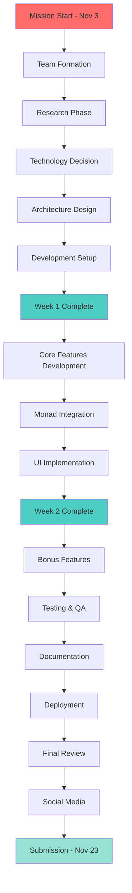
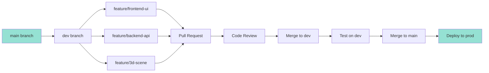

# Technical Roadmap & Timeline

## 📅 Master Timeline Overview

**Start Date:** November 3, 2025  
**Current Date:** November 8, 2025 (Day 6)  
**End Date:** November 23, 2025  
**Total Duration:** 21 days  
**Remaining:** 15 days  

---

## 🎯 Three-Week Sprint Structure

```
Week 1: Foundation & Planning (Nov 3-9)   [CURRENT WEEK]
├─ Days 1-2: Team & Research
├─ Days 3-5: Design & Architecture
└─ Days 6-7: Initial Development

Week 2: Core Development (Nov 10-16)
├─ Days 8-10: Feature Implementation
└─ Days 11-14: Advanced Features

Week 3: Polish & Launch (Nov 17-23)
├─ Days 15-17: Testing & Refinement
├─ Days 18-20: Documentation & Deployment
└─ Days 21-23: Final Submission
```

---

## 📊 Project Flow Diagram



---

## 📅 Detailed Daily Schedule

### WEEK 1: Foundation (Nov 3-9) 🏗️

#### Day 1-2: Team Formation & Research (Nov 3-4) ✅ COMPLETE

**Status:** Completed  
**Goal:** Assemble team, understand mission, research ecosystem

**Tasks Completed:**
- [x] Read mission requirements
- [x] Form team (2-4 members)
- [x] Assign preliminary roles
- [x] Create team communication channel
- [x] Research Monad ecosystem

**Deliverables:**
- ✅ Team roster with roles
- ✅ Communication setup (Discord/Slack)
- ✅ Initial ecosystem analysis

---

#### Day 3-5: Design & Architecture (Nov 5-7) ✅ COMPLETE

**Status:** Completed  
**Goal:** Plan the entire system before writing code

**Day 3 Tasks:** ✅
- [x] Competitive analysis
- [x] Feature prioritization meeting
- [x] Create user personas
- [x] Define user flows

**Day 4 Tasks:** ✅
- [x] Wireframe all pages
- [x] Design system creation
- [x] Color palette selection
- [x] Component library planning

**Day 5 Tasks:** ✅
- [x] Database schema design
- [x] API endpoint planning
- [x] Architecture diagram
- [x] Tech stack finalization

**Deliverables:**
- ✅ Wireframes (all pages)
- ✅ Design system document
- ✅ Database schema
- ✅ Architecture diagram
- ✅ Technology stack document

---

#### Day 6-7: Initial Development (Nov 8-9) 🔄 IN PROGRESS

**Status:** Day 6 in progress, Day 7 tomorrow  
**Goal:** Set up all infrastructure and start building

**Day 6 Tasks (TODAY - Nov 8):** 🔄
- [x] Create GitHub repository
- [x] Initialize frontend project
- [x] Initialize backend project
- [x] Setup development environments (all team)
- [ ] Configure CI/CD pipeline
- [ ] Create project structure
- [ ] Setup database
- [ ] First team standup

**Day 7 Tasks (Nov 9):** ⏳
- [ ] Build basic UI components
- [ ] Implement routing
- [ ] Setup Web3 connection
- [ ] Create API boilerplate
- [ ] Test Monad RPC connection
- [ ] Begin data collection script
- [ ] First deployments (dev environment)

**Deliverables:**
- [ ] Repository with initial code
- [ ] Basic UI running locally
- [ ] Backend API responding
- [ ] Database created
- [ ] Dev environment live

**End of Week 1 Review:**
- [ ] All team members can run project locally
- [ ] Basic navigation works
- [ ] Monad connection tested
- [ ] Ready for feature development

---

### WEEK 2: Core Development (Nov 10-16) 🚀

#### Day 8-10: Feature Implementation (Nov 10-12)

**Status:** Upcoming  
**Goal:** Build all core requirements

**Day 8 Tasks (Nov 10 - Sunday):**
- [ ] **Frontend:**
  - [ ] Home page UI
  - [ ] Dapp listing page
  - [ ] Search component
  - [ ] Filter sidebar

- [ ] **Backend:**
  - [ ] Dapp CRUD endpoints
  - [ ] Search API
  - [ ] Filter logic
  - [ ] Data seeding script

- [ ] **Integration:**
  - [ ] Connect frontend to API
  - [ ] Test data flow
  - [ ] Handle loading states

**Day 9 Tasks (Nov 11 - Monday):**
- [ ] **Frontend:**
  - [ ] Dapp detail page
  - [ ] Category pages
  - [ ] User profile (basic)
  - [ ] Wallet connection UI

- [ ] **Backend:**
  - [ ] Monad mainnet integration
  - [ ] Live data fetching
  - [ ] Caching layer
  - [ ] Analytics tracking

- [ ] **Database:**
  - [ ] Populate with real Monad dapps
  - [ ] Optimize queries
  - [ ] Setup indexes

**Day 10 Tasks (Nov 12 - Tuesday):**
- [ ] **Testing Day:**
  - [ ] Integration testing
  - [ ] Bug fixing
  - [ ] Performance check
  - [ ] Mobile responsive testing

- [ ] **Polish:**
  - [ ] Loading animations
  - [ ] Error handling
  - [ ] Empty states
  - [ ] Success feedback

**Checkpoint:** By end of Day 10, core functionality must work

---

#### Day 11-14: Advanced Features (Nov 13-16)

**Status:** Upcoming  
**Goal:** Implement bonus features for competitive edge

**Day 11 Tasks (Nov 13 - Wednesday):**

**Choose Your Path:** Pick 2-3 bonus features

**Option A: 3D Implementation**
- [ ] Setup Three.js/R3F
- [ ] Create basic 3D scene
- [ ] Add dapp spheres/objects
- [ ] Implement camera controls
- [ ] Test performance

**Option B: Recommendation Engine**
- [ ] Design algorithm
- [ ] Setup tracking
- [ ] Implement basic recommendations
- [ ] Create recommendation API
- [ ] Test accuracy

**Option C: Gamification**
- [ ] Design achievement system
- [ ] Implement tracking
- [ ] Create badge UI
- [ ] Add leaderboard
- [ ] Test progression

**Day 12 Tasks (Nov 14 - Thursday):**
- [ ] Continue chosen bonus features
- [ ] Add visual polish
- [ ] Implement animations
- [ ] Test user experience
- [ ] Get team feedback

**Day 13 Tasks (Nov 15 - Friday):**
- [ ] Complete bonus features
- [ ] Integration with main app
- [ ] Cross-feature testing
- [ ] Performance optimization
- [ ] Begin documentation

**Day 14 Tasks (Nov 16 - Saturday):**
- [ ] **Buffer Day / Catchup**
- [ ] Fix accumulated bugs
- [ ] Refactor messy code
- [ ] Improve error handling
- [ ] Team retrospective

**End of Week 2 Review:**
- [ ] All core features complete
- [ ] 2+ bonus features working
- [ ] No critical bugs
- [ ] Performance acceptable
- [ ] Ready for polish phase

---

### WEEK 3: Polish & Launch (Nov 17-23) 💎

#### Day 15-17: Testing & Refinement (Nov 17-19)

**Status:** Upcoming  
**Goal:** Make everything production-ready

**Day 15 Tasks (Nov 17 - Sunday):**
- [ ] **Comprehensive Testing:**
  - [ ] Test all user flows
  - [ ] Cross-browser testing
  - [ ] Mobile device testing
  - [ ] Performance profiling
  - [ ] Security audit

- [ ] **User Testing:**
  - [ ] Invite friends to test
  - [ ] Collect feedback
  - [ ] Prioritize issues
  - [ ] Create fix list

**Day 16 Tasks (Nov 18 - Monday):**
- [ ] **Bug Fixing Marathon:**
  - [ ] Fix critical bugs (P0)
  - [ ] Fix major bugs (P1)
  - [ ] Fix minor bugs (P2)
  - [ ] Retest fixes
  - [ ] Update issue tracker

- [ ] **Polish Pass:**
  - [ ] Improve animations
  - [ ] Refine interactions
  - [ ] Perfect timing
  - [ ] Add microinteractions

**Day 17 Tasks (Nov 19 - Tuesday):**
- [ ] **Final Features:**
  - [ ] Add remaining polish items
  - [ ] Implement feedback
  - [ ] Optimize performance
  - [ ] Final mobile pass
  - [ ] Accessibility check

- [ ] **Code Cleanup:**
  - [ ] Remove console.logs
  - [ ] Clean up comments
  - [ ] Format code
  - [ ] Update dependencies

---

#### Day 18-20: Documentation & Deployment (Nov 20-22)

**Status:** Upcoming  
**Goal:** Document everything and deploy to production

**Day 18 Tasks (Nov 20 - Wednesday):**
- [ ] **FEATURE FREEZE** 🔒
  - No new features after today
  - Only bugs and documentation

- [ ] **Documentation Writing:**
  - [ ] Complete README.md
  - [ ] Write ARCHITECTURE.md
  - [ ] Create API.md
  - [ ] Write USER_GUIDE.md
  - [ ] Add code comments

- [ ] **Setup Instructions:**
  - [ ] Test installation steps
  - [ ] Create .env.example
  - [ ] Write troubleshooting guide
  - [ ] Document dependencies

**Day 19 Tasks (Nov 21 - Thursday):**
- [ ] **Production Deployment:**
  - [ ] Deploy frontend (Vercel)
  - [ ] Deploy backend (Railway)
  - [ ] Setup production database
  - [ ] Configure environment variables
  - [ ] Test production build

- [ ] **Domain & SSL:**
  - [ ] Purchase/configure domain (optional)
  - [ ] Setup SSL certificates
  - [ ] Test HTTPS
  - [ ] Configure DNS

- [ ] **Monitoring:**
  - [ ] Setup error tracking
  - [ ] Configure analytics
  - [ ] Test monitoring
  - [ ] Create status dashboard

**Day 20 Tasks (Nov 22 - Friday):**
- [ ] **Final Testing:**
  - [ ] Test production deployment
  - [ ] Verify all features work
  - [ ] Test on multiple devices
  - [ ] Speed test
  - [ ] Final QA pass

- [ ] **Content Creation:**
  - [ ] Take screenshots
  - [ ] Record demo video
  - [ ] Create GIFs
  - [ ] Prepare tweet content
  - [ ] Write submission text

---

#### Day 21-23: Final Submission (Nov 23)

**Status:** Upcoming  
**Goal:** Submit on time with everything perfect

**Day 21 Tasks (Nov 23 - Saturday - SUBMISSION DAY):**

**Morning (3 hours):**
- [ ] 08:00 - Final smoke testing
- [ ] 09:00 - Last-minute bug fixes
- [ ] 10:00 - Verify all links work
- [ ] 11:00 - Team review meeting

**Afternoon (4 hours):**
- [ ] 12:00 - Prepare submission materials
- [ ] 13:00 - Fill out submission form
- [ ] 14:00 - Submit to Tally form
- [ ] 15:00 - Publish tweet
- [ ] 16:00 - Verification check

**Evening:**
- [ ] Celebrate with team! 🎉
- [ ] Monitor for any issues
- [ ] Engage with community
- [ ] Backup everything

**SUBMISSION CHECKLIST:**
```
Submission Form (https://tally.so/r/31qYe4):
- [ ] Project name
- [ ] Live URL
- [ ] GitHub repository
- [ ] Team member names
- [ ] Team member contacts
- [ ] Description
- [ ] Technologies used
- [ ] Screenshots/demo
- [ ] Twitter link

Social Media:
- [ ] Tweet published
- [ ] Tagged @monad_xyz
- [ ] 4 images/GIFs included
- [ ] Links tested
- [ ] Team members retweeted

Final Verification:
- [ ] Submission confirmed
- [ ] All links accessible
- [ ] No downtime
- [ ] Email confirmation received
```

---

## 🔄 Development Workflow

### Daily Standup Structure

**Time:** Every day at 10:00 AM (15 minutes max)

**Format:**
```
Each team member answers:
1. What did I complete yesterday?
2. What will I work on today?
3. Any blockers or issues?

Project Manager notes:
- Overall progress
- Risks
- Adjustments needed
```

### Git Workflow



**Branch Strategy:**
```bash
main (production)
└── dev (testing)
    ├── feature/dapp-listing
    ├── feature/search-filter
    ├── feature/3d-experience
    └── feature/recommendations

# Naming convention:
# feature/description-of-feature
# bugfix/description-of-bug
# hotfix/urgent-fix
```

**Commit Convention:**
```bash
# Format: type(scope): description

feat(frontend): add dapp card component
fix(api): resolve search query bug
docs(readme): update installation instructions
style(ui): improve button hover effects
refactor(backend): optimize database queries
test(integration): add API endpoint tests

# Types:
# feat: New feature
# fix: Bug fix
# docs: Documentation
# style: Formatting, no code change
# refactor: Code change that neither fixes bug nor adds feature
# test: Adding tests
# chore: Maintenance
```

---

## ⚡ Critical Path Analysis

### Must-Complete Tasks (Blockers)

**Week 1 Blockers:**
```
1. Repository setup → Everything depends on this
2. Monad RPC connection → Needed for data
3. Database schema → Needed for API
4. Basic UI structure → Needed for features
```

**Week 2 Blockers:**
```
1. Dapp data collection → Needed for everything
2. API endpoints → Needed for frontend
3. Monad integration → Core requirement
4. Choose bonus features early → Time-intensive
```

**Week 3 Blockers:**
```
1. Bug fixes → Can't submit broken app
2. Documentation → Required for submission
3. Deployment → Must be accessible
4. Submission form → Must submit on time
```

### Parallel Work Tracks

**Track 1: Frontend (Continuous)**
```
Week 1: Setup + Basic UI
Week 2: Feature implementation
Week 3: Polish + Testing
```

**Track 2: Backend (Continuous)**
```
Week 1: Setup + API structure
Week 2: Monad integration + Features
Week 3: Optimization + Deployment
```

**Track 3: Design (Front-loaded)**
```
Week 1: All design work (80%)
Week 2: Design polish (15%)
Week 3: Final touches (5%)
```

**Track 4: Documentation (Back-loaded)**
```
Week 1: Initial docs (20%)
Week 2: Document as you build (20%)
Week 3: Complete documentation (60%)
```

---

## 🎯 Feature Priority Matrix

### Phase 1: Must-Have (Week 1-2)

**Priority Level: P0 (Critical)**
```
Time Est.  Feature
────────────────────────────────────
8h        Dapp listing page
6h        Dapp detail page
4h        Search functionality
4h        Category filters
12h       Monad mainnet integration
6h        Wallet connection
8h        Responsive design
6h        Basic documentation
────────────────────────────────────
54h       Total P0 work
```

### Phase 2: Should-Have (Week 2)

**Priority Level: P1 (High)**
```
Time Est.  Feature
────────────────────────────────────
20-30h    3D/Immersive experience
15-20h    Smart recommendations
8-12h     Novel visualization
6-8h      User profiles
────────────────────────────────────
49-70h    Total P1 work (choose 1-2)
```

### Phase 3: Nice-to-Have (Week 2-3)

**Priority Level: P2 (Medium)**
```
Time Est.  Feature
────────────────────────────────────
12-16h    Gamification system
8-12h     Creative branding
6-8h      Social features
4-6h      Advanced filters
3-4h      Dark mode
────────────────────────────────────
33-46h    Total P2 work (if time permits)
```

---

## 📊 Time Allocation Strategy

### Team of 4 (Recommended)

**Total Available Hours:**
```
4 people × 15 days × 8 hours/day = 480 hours
Realistic productive hours: 480 × 0.7 = 336 hours
```

**Hour Distribution:**
```
Core Features (P0):        168 hours (50%)
Bonus Features (P1):       101 hours (30%)
Polish & Testing:           50 hours (15%)
Documentation:              17 hours (5%)
────────────────────────────────────
Total:                     336 hours
```

### Team of 3

**Total Available Hours:**
```
3 people × 15 days × 8 hours/day = 360 hours
Realistic productive hours: 360 × 0.7 = 252 hours
```

**Adjusted Strategy:**
- Focus on core + 1 major bonus
- Reduce scope slightly
- More efficient collaboration needed

### Team of 2 (Minimum)

**Total Available Hours:**
```
2 people × 15 days × 8 hours/day = 240 hours
Realistic productive hours: 240 × 0.7 = 168 hours
```

**Adjusted Strategy:**
- Core features only initially
- Choose 1 bonus feature you excel at
- May need to cut some nice-to-haves
- Documentation must be prioritized

---

## 🚨 Risk Management

### High-Risk Items

**Risk 1: Time Constraint**
```
Risk: Only 15 days left
Impact: HIGH
Probability: CERTAIN

Mitigation:
- Aggressive scope management
- Daily progress tracking
- Cut features if behind schedule
- Maintain buffer time
```

**Risk 2: Monad Integration Issues**
```
Risk: Blockchain integration always has surprises
Impact: HIGH
Probability: MEDIUM

Mitigation:
- Start integration on Day 7
- Have fallback mock data
- Test early and often
- Document issues for judges
```

**Risk 3: Team Coordination**
```
Risk: Merge conflicts, miscommunication
Impact: MEDIUM
Probability: MEDIUM

Mitigation:
- Clear Git workflow
- Daily standups
- Use project management tool
- Pair programming for complex parts
```

**Risk 4: 3D Performance Issues**
```
Risk: 3D might be slow on low-end devices
Impact: MEDIUM
Probability: MEDIUM

Mitigation:
- Optimize early
- LOD (Level of Detail) system
- Fallback to 2D view
- Performance budget
```

### Medium-Risk Items

**Risk 5: Scope Creep**
```
Mitigation:
- Feature freeze Nov 20
- Reject new ideas after Week 1
- Focus on polish over features
```

**Risk 6: Deployment Issues**
```
Mitigation:
- Deploy to dev early (Day 7)
- Test prod deployment Day 19
- Have backup hosting plans
```

**Risk 7: Data Collection Problems**
```
Mitigation:
- Start scraping Day 1
- Have manual data entry backup
- Use multiple data sources
```

---

## 📈 Progress Tracking

### Milestones & Checkpoints

**Milestone 1: Development Ready (Nov 9)**
```
✓ Goals:
- All team members can run project
- Basic UI scaffold exists
- Backend responds to requests
- Database is setup
- Monad connection tested

Success Criteria:
- Can demo basic navigation
- No setup blockers
```

**Milestone 2: Core Complete (Nov 14)**
```
✓ Goals:
- All P0 features working
- Data flowing end-to-end
- Search and filters functional
- Monad integration complete

Success Criteria:
- Can find any dapp
- Data is accurate
- No critical bugs
```

**Milestone 3: Feature Freeze (Nov 20)**
```
✓ Goals:
- All features complete
- Bonus features integrated
- Basic testing done
- Documentation started

Success Criteria:
- Ready for polish phase
- No new feature work needed
```

**Milestone 4: Submission Ready (Nov 22)**
```
✓ Goals:
- All bugs fixed
- Documentation complete
- Production deployed
- Content prepared

Success Criteria:
- Could submit today if needed
- Everything polished
```

### Daily Progress Metrics

**Track These Daily:**
```
✓ Features completed
✓ Bugs fixed
✓ Tests passing
✓ Documentation progress
✓ Blockers
✓ Team morale

Tool: Linear, Notion, or GitHub Projects
Update: End of each day
Review: Morning standup
```

---

## 🎬 Launch Day Checklist (Nov 23)

### T-24 Hours (Nov 22, 10am)

- [ ] All code merged to main
- [ ] Production deployment stable
- [ ] All tests passing
- [ ] Documentation complete
- [ ] Demo video recorded
- [ ] Screenshots taken
- [ ] Tweet drafted
- [ ] Submission form drafted

### T-12 Hours (Nov 22, 10pm)

- [ ] Final testing complete
- [ ] All known bugs fixed
- [ ] Performance verified
- [ ] Mobile tested
- [ ] Links verified
- [ ] Team approval

### Launch Morning (Nov 23, 8am)

- [ ] 08:00 - Final smoke test
- [ ] 09:00 - Team sync call
- [ ] 10:00 - Review submission
- [ ] 11:00 - Buffer time

### Launch Afternoon (Nov 23, 12pm)

- [ ] 12:00 - Submit form
- [ ] 12:30 - Verify submission
- [ ] 13:00 - Publish tweet
- [ ] 13:30 - Monitor responses
- [ ] 14:00 - Engage community
- [ ] 15:00 - Final verification
- [ ] 16:00 - Team celebration!

---

## 📞 Communication Plan

### Daily Touchpoints

**Morning Standup (10:00 AM)**
- Duration: 15 minutes
- Format: Async-first (written), sync if needed
- Platform: Discord/Slack

**Evening Update (6:00 PM)**
- Duration: 5 minutes
- Format: Written status update
- What got done today
- Plans for tomorrow

**Weekend Check-ins**
- Less formal
- Progress updates
- Blocker resolution

### Emergency Protocols

**If Falling Behind:**
1. Team meeting within 2 hours
2. Reassess scope
3. Cut features if needed
4. Redistribute work

**If Technical Blocker:**
1. Try for 2 hours
2. Ask team for help
3. Research alternatives
4. Escalate if critical

**If Team Member Unavailable:**
1. Redistribute their tasks
2. Update timeline
3. Document handoff
4. Continue with reduced scope

---

## 🏆 Success Metrics

### Week 1 Success

- [ ] Repository setup complete
- [ ] Design system created
- [ ] Architecture documented
- [ ] Dev environment working
- [ ] Team velocity established
- [ ] Monad data collected

**Score: Pass if 5/6 complete**

### Week 2 Success

- [ ] All core features working
- [ ] 2+ bonus features implemented
- [ ] Mobile responsive
- [ ] No critical bugs
- [ ] Performance acceptable
- [ ] Integration tests passing

**Score: Pass if 5/6 complete**

### Week 3 Success

- [ ] Production deployed
- [ ] Documentation complete
- [ ] All tests passing
- [ ] Social content ready
- [ ] Submission completed
- [ ] Team satisfied with result

**Score: Pass if 6/6 complete**

---

**Last Updated:** November 8, 2025  
**Current Phase:** Week 1, Day 6  
**Next Milestone:** Development Ready (Nov 9)  
**Days Until Submission:** 15 days

----------------------------------------------------------------------------------