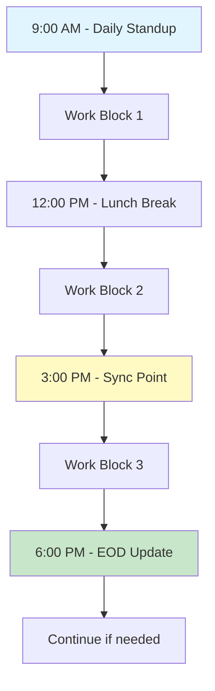
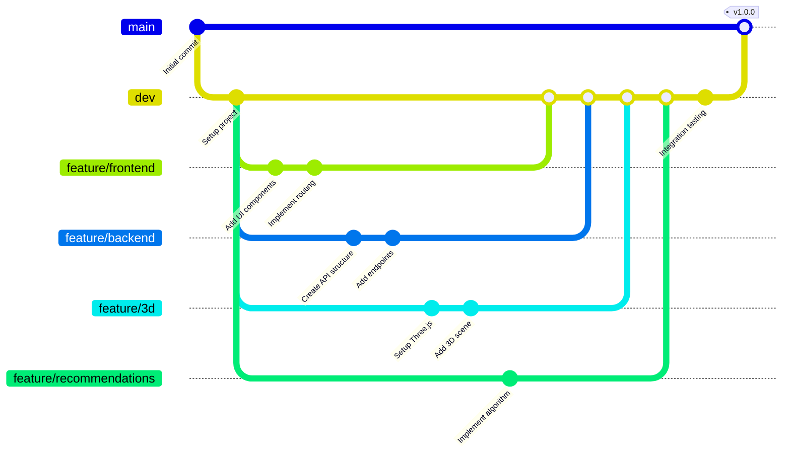
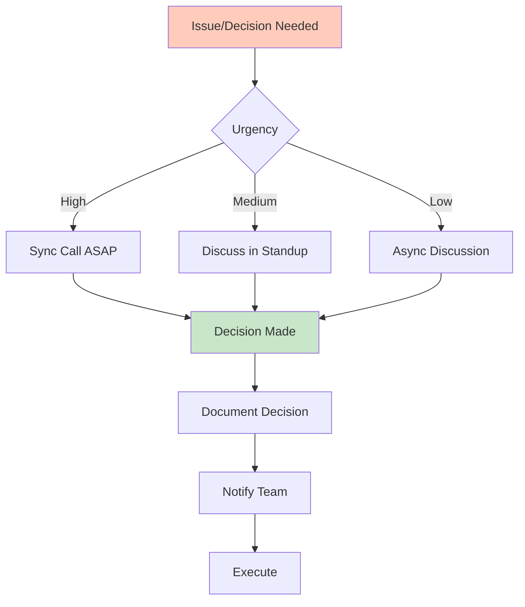

# Team Structure & Roles

## 📋 Table of Contents
1. [Team Configuration Options](#team-configuration-options)
2. [Detailed Role Definitions](#detailed-role-definitions)
3. [Responsibility Matrix](#responsibility-matrix)
4. [Workflow & Collaboration](#workflow--collaboration)
5. [Communication Plan](#communication-plan)
6. [Task Distribution](#task-distribution)

---

## 👥 Team Configuration Options

### Option 1: 4-Person Team (Recommended)

```
┌─────────────────────────────────────────────────────┐
│                  TEAM STRUCTURE                      │
├─────────────────────────────────────────────────────┤
│                                                      │
│  ┌────────────────┐         ┌────────────────┐    │
│  │   Frontend     │◄───────►│    Backend     │    │
│  │   Developer    │         │   Developer    │    │
│  │   + 3D Lead    │         │ + Blockchain   │    │
│  └────────────────┘         └────────────────┘    │
│         ▲                           ▲              │
│         │                           │              │
│         │    ┌──────────────┐      │              │
│         └────┤  Project Mgr │──────┘              │
│              │  + Designer  │                      │
│              └──────┬───────┘                      │
│                     │                              │
│              ┌──────▼───────┐                      │
│              │   ML/AI Eng  │                      │
│              │ + Rec System │                      │
│              └──────────────┘                      │
│                                                     │
└─────────────────────────────────────────────────────┘
```

**Advantages:**
- Specialized roles for each domain
- Parallel development streams
- Higher quality output
- Can implement all bonus features

**Time Allocation:**
- Frontend: 35%
- Backend: 30%
- PM/Design: 20%
- ML/Recommendations: 15%

---

### Option 2: 3-Person Team (Balanced)

```
┌─────────────────────────────────────────────────────┐
│                  TEAM STRUCTURE                      │
├─────────────────────────────────────────────────────┤
│                                                      │
│         ┌────────────────────────────┐             │
│         │     Fullstack Lead         │             │
│         │  (Frontend + Backend)      │             │
│         └────────────┬───────────────┘             │
│                      │                              │
│         ┌────────────┴───────────┐                 │
│         ▼                        ▼                  │
│  ┌──────────────┐        ┌──────────────┐         │
│  │   3D/Visual  │        │  PM/Designer │         │
│  │  Specialist  │        │  + QA Lead   │         │
│  │   + ML/AI    │        │              │         │
│  └──────────────┘        └──────────────┘         │
│                                                     │
└─────────────────────────────────────────────────────┘
```

**Advantages:**
- More efficient for 3-week timeline
- Less coordination overhead
- Faster decision making

**Time Allocation:**
- Fullstack: 45%
- 3D/ML: 35%
- PM/Design: 20%

---

### Option 3: 2-Person Team (Minimum)

```
┌─────────────────────────────────────────────────────┐
│                  TEAM STRUCTURE                      │
├─────────────────────────────────────────────────────┤
│                                                      │
│     ┌────────────────────────────────────┐         │
│     │     Technical Lead (Person A)      │         │
│     │  - Fullstack Development           │         │
│     │  - Architecture                    │         │
│     │  - Blockchain Integration          │         │
│     │  - Backend & APIs                  │         │
│     └────────────┬───────────────────────┘         │
│                  │                                  │
│                  ▼                                  │
│     ┌────────────────────────────────────┐         │
│     │   Design/Frontend Dev (Person B)   │         │
│     │  - UI/UX Design                    │         │
│     │  - Frontend Development            │         │
│     │  - 3D Implementation               │         │
│     │  - Documentation                   │         │
│     └────────────────────────────────────┘         │
│                                                     │
└─────────────────────────────────────────────────────┘
```

**Advantages:**
- Minimal coordination
- Quick decisions
- Lower communication overhead

**Challenges:**
- Must carefully scope features
- Less time for bonus features
- Higher individual workload

**Time Allocation:**
- Person A: 50%
- Person B: 50%

---

## 🎯 Detailed Role Definitions

### Role 1: Frontend Developer / 3D Lead

**Primary Responsibilities:**
- Build React application structure
- Implement all UI components
- Develop 3D immersive experience
- Web3 wallet integration
- Responsive design implementation

#### Daily Tasks

**Week 1:**
```
Day 1-2: Setup & Planning
├─ Initialize React project with Vite
├─ Setup Tailwind CSS
├─ Install Three.js/R3F dependencies
├─ Create component structure
└─ Setup routing

Day 3-5: Core UI Development
├─ Build layout components (Header, Footer)
├─ Create design system
├─ Implement basic pages (Home, Explore)
├─ Setup state management (Zustand)
└─ Integrate with API (mock data first)

Day 6-7: Initial 3D Setup
├─ Create Three.js scene
├─ Setup camera and controls
├─ Test basic 3D rendering
└─ Performance testing
```

**Week 2:**
```
Day 8-10: Feature Implementation
├─ Complete all page layouts
├─ Implement search functionality
├─ Build filter components
├─ Create dapp card components
└─ Integrate real API data

Day 11-14: 3D Experience
├─ Develop dapp sphere components
├─ Implement particle effects
├─ Add interactions (click, hover)
├─ Optimize performance
├─ Add transitions and animations
└─ Mobile responsive testing
```

**Week 3:**
```
Day 15-17: Polish & Testing
├─ Fix UI bugs
├─ Improve animations
├─ Cross-browser testing
├─ Performance optimization
└─ Accessibility improvements

Day 18-23: Final touches
├─ Final UI polish
├─ Documentation
├─ Help with deployment
└─ Create demo content
```

#### Skills Required
- ✅ React 18+ (hooks, context)
- ✅ TypeScript
- ✅ Three.js or React Three Fiber
- ✅ Tailwind CSS
- ✅ Web3 libraries (ethers.js, wagmi)
- ✅ Git/GitHub
- ⭐ GSAP or Framer Motion (bonus)
- ⭐ WebGL knowledge (bonus)

#### Deliverables
- [ ] Complete React application
- [ ] All UI components
- [ ] 3D immersive experience
- [ ] Wallet integration
- [ ] Responsive design (mobile/tablet/desktop)
- [ ] Performance optimized frontend
- [ ] Component documentation

#### Success Metrics
- First paint < 1 second
- Time to interactive < 3 seconds
- 60fps animations
- Lighthouse score > 90
- Works on Chrome, Firefox, Safari
- Mobile responsive

---

### Role 2: Backend Developer / Blockchain Lead

**Primary Responsibilities:**
- Design and build REST API
- Database design and implementation
- Monad mainnet integration
- Authentication system
- Analytics and tracking
- Server deployment

#### Daily Tasks

**Week 1:**
```
Day 1-2: Architecture & Setup
├─ Design database schema
├─ Initialize Node.js project
├─ Setup PostgreSQL database
├─ Configure Redis cache
└─ Create API structure

Day 3-5: Core API Development
├─ Implement dapp CRUD endpoints
├─ Build search endpoint
├─ Create filter logic
├─ Setup authentication
└─ Add validation middleware

Day 6-7: Blockchain Integration
├─ Research Monad RPC endpoints
├─ Test connection to mainnet
├─ Implement contract interactions
├─ Fetch live TVL/metrics
└─ Error handling for blockchain calls
```

**Week 2:**
```
Day 8-10: Feature APIs
├─ Complete all dapp endpoints
├─ Build user endpoints
├─ Implement favorites system
├─ Add interaction tracking
└─ Setup rate limiting

Day 11-14: Advanced Features
├─ Implement recommendation logic
├─ Build analytics endpoints
├─ Optimize database queries
├─ Setup caching strategy
├─ Integration testing
└─ API documentation
```

**Week 3:**
```
Day 15-17: Testing & Optimization
├─ Performance testing
├─ Load testing
├─ Security audit
├─ Bug fixing
└─ Database optimization

Day 18-23: Deployment
├─ Deploy to Railway/Render
├─ Setup production database
├─ Configure environment variables
├─ Monitor deployment
└─ Final API testing
```

#### Skills Required
- ✅ Node.js + Express
- ✅ PostgreSQL + SQL
- ✅ RESTful API design
- ✅ ethers.js / Web3.js
- ✅ JWT authentication
- ✅ Redis caching
- ⭐ Docker (bonus)
- ⭐ DevOps experience (bonus)

#### Deliverables
- [ ] Complete REST API
- [ ] Database with schema
- [ ] Monad mainnet integration
- [ ] Authentication system
- [ ] Analytics tracking
- [ ] API documentation
- [ ] Deployed backend server

#### Success Metrics
- API response time < 200ms
- 99% uptime
- Handles 100 req/sec
- All endpoints documented
- Zero SQL injection vulnerabilities
- Successful Monad integration

---

### Role 3: ML/AI Engineer / Recommendation System

**Primary Responsibilities:**
- Design recommendation algorithm
- Implement user behavior tracking
- Build personalization engine
- Data analysis
- Algorithm optimization

#### Daily Tasks

**Week 1:**
```
Day 1-2: Research & Design
├─ Study recommendation algorithms
├─ Analyze similar platforms
├─ Design recommendation logic
├─ Plan data collection strategy
└─ Create algorithm flowchart

Day 3-5: Data Infrastructure
├─ Design interaction tracking
├─ Create data collection endpoints
├─ Setup data processing pipeline
├─ Build analytics dashboard (internal)
└─ Test data collection

Day 6-7: Basic Algorithm
├─ Implement content-based filtering
├─ Create similarity calculations
├─ Build basic recommendation API
└─ Test with sample data
```

**Week 2:**
```
Day 8-10: Algorithm Development
├─ Implement collaborative filtering
├─ Build hybrid recommendation system
├─ Add popularity-based recommendations
├─ Create cold-start solutions
└─ Test different algorithms

Day 11-14: Optimization
├─ Optimize algorithm performance
├─ Add caching for recommendations
├─ Implement A/B testing framework
├─ Tune recommendation quality
└─ Integration with main API
```

**Week 3:**
```
Day 15-17: Testing & Refinement
├─ Test recommendation accuracy
├─ Collect real user data
├─ Analyze recommendation quality
├─ Fix algorithm issues
└─ Performance optimization

Day 18-23: Final Polish
├─ Documentation
├─ Create recommendation metrics
├─ Help with general features
└─ Prepare demo scenarios
```

#### Skills Required
- ✅ Python or JavaScript
- ✅ Machine learning fundamentals
- ✅ Data analysis
- ✅ scikit-learn (if Python)
- ✅ SQL for data queries
- ⭐ TensorFlow/PyTorch (bonus)
- ⭐ Big data experience (bonus)

#### Deliverables
- [ ] Recommendation engine
- [ ] User behavior tracking system
- [ ] Personalization algorithms
- [ ] Analytics dashboard
- [ ] Algorithm documentation
- [ ] Performance metrics

#### Success Metrics
- Recommendation accuracy > 70%
- Response time < 100ms
- Diverse recommendations
- Handles cold start problem
- Scales to 10k+ users

---

### Role 4: Project Manager / UI/UX Designer

**Primary Responsibilities:**
- Project planning and timeline management
- UI/UX design
- Team coordination
- Documentation writing
- QA testing
- Social media content

#### Daily Tasks

**Week 1:**
```
Day 1-2: Planning Phase
├─ Create project timeline
├─ Setup project management tool
├─ Define milestones
├─ Create task breakdown
└─ Setup team communication

Day 3-5: Design Phase
├─ Create wireframes
├─ Design UI mockups (Figma)
├─ Define color palette
├─ Create component library
├─ Design 3D scene concepts
└─ Get team approval

Day 6-7: Setup & Coordination
├─ Daily standups
├─ Track progress
├─ Resolve blockers
├─ Update documentation
└─ Review designs with team
```

**Week 2:**
```
Day 8-14: Development Support
├─ Daily standups
├─ Track feature progress
├─ Test completed features
├─ Provide design feedback
├─ Update documentation
├─ Create user flows
└─ Begin documentation writing
```

**Week 3:**
```
Day 15-17: QA Phase
├─ Comprehensive testing
├─ Bug tracking
├─ User testing sessions
├─ Feedback collection
└─ Priority bug list

Day 18-20: Documentation
├─ Write README
├─ Create user guide
├─ Document architecture
├─ API documentation review
└─ Create demo video

Day 21-23: Launch
├─ Final testing
├─ Prepare submission materials
├─ Create social media content
├─ Submit form
├─ Publish tweet
└─ Team celebration
```

#### Skills Required
- ✅ Figma or Adobe XD
- ✅ UI/UX design principles
- ✅ Project management
- ✅ Technical writing
- ✅ QA testing
- ✅ Attention to detail
- ⭐ Graphic design (bonus)
- ⭐ Video editing (bonus)

#### Deliverables
- [ ] Complete design system
- [ ] All wireframes and mockups
- [ ] Project timeline (maintained)
- [ ] Complete documentation
- [ ] QA test reports
- [ ] Social media content
- [ ] Demo video

#### Success Metrics
- All milestones hit on time
- Zero missed deadlines
- Complete documentation
- Professional design quality
- All bugs tracked and fixed
- Successful submission

---

## 📊 Responsibility Matrix (RACI)

### Legend
- **R** = Responsible (Does the work)
- **A** = Accountable (Final approval)
- **C** = Consulted (Provides input)
- **I** = Informed (Kept in the loop)

### Task Matrix

| Task | Frontend | Backend | ML/AI | PM/Design |
|------|----------|---------|-------|-----------|
| **Week 1: Planning** |
| Project timeline | I | I | I | **A/R** |
| Architecture design | **C** | **A/R** | C | I |
| Database schema | I | **A/R** | C | I |
| UI/UX design | C | I | I | **A/R** |
| Tech stack selection | **C** | **C** | C | **A** |
| Repository setup | **C** | **R** | I | **A** |
| **Week 1-2: Core Development** |
| Frontend components | **A/R** | I | I | C |
| Backend API | I | **A/R** | C | I |
| Database implementation | I | **A/R** | C | I |
| Monad integration | C | **A/R** | I | I |
| 3D scene development | **A/R** | I | I | C |
| Wallet connection | **A/R** | C | I | C |
| Search/filter logic | **R** | **R** | I | C |
| User authentication | C | **A/R** | I | I |
| **Week 2: Bonus Features** |
| Recommendation engine | I | C | **A/R** | I |
| User tracking | C | **R** | **R** | I |
| Gamification | **R** | **R** | C | **A** |
| 3D optimization | **A/R** | I | I | C |
| **Week 3: Testing & Launch** |
| Frontend testing | **A/R** | I | I | **R** |
| Backend testing | I | **A/R** | I | **R** |
| Integration testing | **R** | **R** | **R** | **A** |
| Bug fixing | **R** | **R** | **R** | **A** |
| Performance optimization | **R** | **R** | **R** | **A** |
| Documentation | **R** | **R** | **R** | **A** |
| Deployment | **C** | **A/R** | I | **C** |
| Social media content | C | I | I | **A/R** |
| Submission | C | C | C | **A/R** |

---

## 🔄 Workflow & Collaboration

### Daily Workflow



### Git Workflow



### Code Review Process

```
1. Developer creates Pull Request
   └─ Fill out PR template
   └─ Link to related issue
   └─ Add screenshots if UI change
   
2. Automated Checks Run
   └─ CI/CD pipeline
   └─ Linting
   └─ Tests
   └─ Build verification
   
3. Code Review (Required: 1 approval)
   └─ Review code quality
   └─ Check for bugs
   └─ Verify tests
   └─ Suggest improvements
   
4. Address Feedback
   └─ Make requested changes
   └─ Respond to comments
   └─ Request re-review
   
5. Merge to dev
   └─ Squash commits
   └─ Delete feature branch
   └─ Deploy to dev environment
```

---

## 💬 Communication Plan

### Communication Channels

```
┌─────────────────────────────────────────────────────┐
│             COMMUNICATION STRUCTURE                  │
├─────────────────────────────────────────────────────┤
│                                                      │
│  Daily Standup (Sync)          → Video Call         │
│  ├─ Time: 10:00 AM daily       → 15 minutes max    │
│  └─ Format: Quick updates       → Discord/Zoom      │
│                                                      │
│  Async Updates                 → Slack/Discord      │
│  ├─ Progress updates           → #general           │
│  ├─ Blockers                   → #blockers          │
│  └─ Questions                  → #help              │
│                                                      │
│  Code Reviews                  → GitHub             │
│  └─ Pull requests              → Notifications on   │
│                                                      │
│  Design Reviews                → Figma              │
│  └─ Comments on designs        → Tag team members   │
│                                                      │
│  Documentation                 → Notion/GitHub Wiki │
│  └─ Shared knowledge base      → Always up to date  │
│                                                      │
│  Emergency                     → Phone/DM           │
│  └─ Critical blockers          → Immediate response │
│                                                      │
└─────────────────────────────────────────────────────┘
```

### Standup Format (15 min max)

**Each team member shares:**
```
1. What I completed yesterday
   Example: "Finished dapp card component and search bar"

2. What I'm working on today
   Example: "Building filter sidebar and 3D scene setup"

3. Any blockers?
   Example: "Need backend API endpoint for filters"

4. Help needed?
   Example: "Could use design feedback on card hover state"
```

**PM tracks:**
- Overall progress vs timeline
- Risks and blockers
- Decisions needed

### Weekly Check-ins (30-60 min)

**Every Sunday at 3:00 PM:**
```
1. Review past week
   ├─ What went well
   ├─ What didn't go well
   └─ Lessons learned

2. Plan next week
   ├─ Priority tasks
   ├─ Assignments
   └─ Potential risks

3. Demo progress
   ├─ Each person shows work
   ├─ Get feedback
   └─ Celebrate wins

4. Address concerns
   └─ Open discussion
```

### Decision-Making Process



---

## 📋 Task Distribution

### Week 1 Task Allocation

#### Frontend Developer
```
[ ] Day 1-2: Project setup (8h)
[ ] Day 3-4: Component library (12h)
[ ] Day 5: Page layouts (8h)
[ ] Day 6-7: Integration + 3D setup (16h)
Total: 44 hours
```

#### Backend Developer
```
[ ] Day 1-2: Database + API setup (12h)
[ ] Day 3-4: Core endpoints (12h)
[ ] Day 5: Authentication (8h)
[ ] Day 6-7: Monad integration (12h)
Total: 44 hours
```

#### ML/AI Engineer
```
[ ] Day 1-2: Research + design (8h)
[ ] Day 3-4: Data infrastructure (12h)
[ ] Day 5: Algorithm design (8h)
[ ] Day 6-7: Basic implementation (16h)
Total: 44 hours
```

#### PM/Designer
```
[ ] Day 1-2: Planning + kickoff (8h)
[ ] Day 3-4: Full design system (16h)
[ ] Day 5: User flows (6h)
[ ] Day 6-7: Coordination + docs (14h)
Total: 44 hours
```

### Week 2 Task Allocation

#### Frontend Developer (Focus: Features + 3D)
```
High Priority:
[ ] Complete all page implementations (20h)
[ ] 3D scene with interactions (16h)
[ ] Mobile responsive (8h)

Medium Priority:
[ ] Animations and transitions (6h)
[ ] Performance optimization (6h)
Total: 56 hours
```

#### Backend Developer (Focus: Integration + Features)
```
High Priority:
[ ] All API endpoints complete (16h)
[ ] Monad live data integration (12h)
[ ] Caching layer (8h)

Medium Priority:
[ ] Rate limiting (4h)
[ ] Analytics endpoints (8h)
[ ] Testing (8h)
Total: 56 hours
```

#### ML/AI Engineer (Focus: Recommendations)
```
High Priority:
[ ] Recommendation algorithm (20h)
[ ] User tracking (12h)
[ ] Integration with API (8h)

Medium Priority:
[ ] Algorithm optimization (8h)
[ ] Testing (8h)
Total: 56 hours
```

#### PM/Designer (Focus: QA + Docs)
```
High Priority:
[ ] Daily standups + coordination (14h)
[ ] Feature testing (16h)
[ ] Bug tracking (8h)

Medium Priority:
[ ] Documentation writing (10h)
[ ] Design refinements (8h)
Total: 56 hours
```

### Week 3 Task Allocation

**All hands on deck for:**
- Testing and bug fixing
- Documentation completion
- Deployment
- Polish and refinement
- Submission preparation

**Distribution:**
- 40% Testing/Bug fixing
- 30% Documentation
- 20% Polish/Refinement
- 10% Submission prep

---

## 🎯 Success Criteria by Role

### Frontend Developer Success
- ✅ All pages render correctly
- ✅ 3D scene runs at 60fps
- ✅ Mobile responsive works
- ✅ Wallet connection functional
- ✅ Zero console errors
- ✅ Lighthouse score > 90

### Backend Developer Success
- ✅ All API endpoints working
- ✅ Live Monad data flowing
- ✅ Response times < 200ms
- ✅ Zero downtime deployment
- ✅ Security best practices followed
- ✅ Complete API documentation

### ML/AI Engineer Success
- ✅ Recommendations are relevant
- ✅ Algorithm performs well
- ✅ Handles cold start
- ✅ Scales to many users
- ✅ Documented approach
- ✅ Integrated smoothly

### PM/Designer Success
- ✅ Project delivered on time
- ✅ Professional design quality
- ✅ Complete documentation
- ✅ All bugs tracked/fixed
- ✅ Successful submission
- ✅ Team satisfied

---

## 📞 Escalation Path

### When to Escalate

**Level 1: Self-Solve (2 hours)**
- Try to solve independently
- Research documentation
- Check Stack Overflow

**Level 2: Ask Team (4 hours)**
- Post in team chat
- Ask for quick help
- Pair program if needed

**Level 3: Team Meeting (8 hours)**
- Call emergency sync
- Discuss as group
- Make decision together

**Level 4: Scope Adjustment (12+ hours)**
- Acknowledge blocker
- Adjust timeline
- Cut features if needed

---

## 🎉 Team Culture

### Core Values
1. **Transparency** - Share progress and blockers openly
2. **Ownership** - Take responsibility for your domain
3. **Collaboration** - Help each other succeed
4. **Quality** - Do it right, not just fast
5. **Fun** - Enjoy the process!

### Celebration Points
- [ ] First commit
- [ ] Dev environment working for all
- [ ] First successful deployment
- [ ] Core features complete
- [ ] Bonus feature working
- [ ] Submission completed
- [ ] 🎉 Final celebration!

---

**Last Updated:** November 8, 2025  
**Next Document:** `05_TECHNOLOGY_STACK.md`

----------------------------------------------------------------------------------